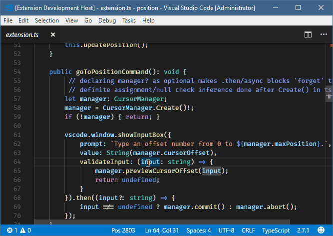

# vscode-position README

This is the README "vscode-position".  I had been using the [Positions](https://github.com/Silvenga/vscode-positions) extension for seeing the offset but had a need to set the position by offset easily.  So I wrote this, partially because the mentioned extension to learn a bit about typescript.  As I finished I came across [show-offset](https://github.com/ramya-rao-a/show-offset) which I wish I'd run across initially.  Nevertheless, I had added a couple unique features when I wrote this, so I figured I'd toss it into the gallery.

## Features

- Shows cursor character offset as 'Pos \<position>' in the status bar.
- Click the status bar or use the `Go To Position` palette command to move the cursor by offset.
- New position is previewed while typing it in (similar to goto line)
- Cursor and selection restored if setting position is abandoned with <kbd>esc</kbd>
- Cursor position can also be <kbd>+</kbd><kbd>*number*</kbd> or <kbd>-</kbd><kbd>*number*</kbd> for moving the cursor relative to the current position.

> Initial keybinding for `Go To Position`: <kbd>⌃</kbd>+<kbd>Alt</kbd>+<kbd>G</kbd> (Mac:  <kbd>⌃</kbd>+<kbd>⌘</kbd>+<kbd>G</kbd>)

## Requirements
None
## Extension Settings
None

## Known Issues

## Release Notes
### 1.0.0

Initial release.

